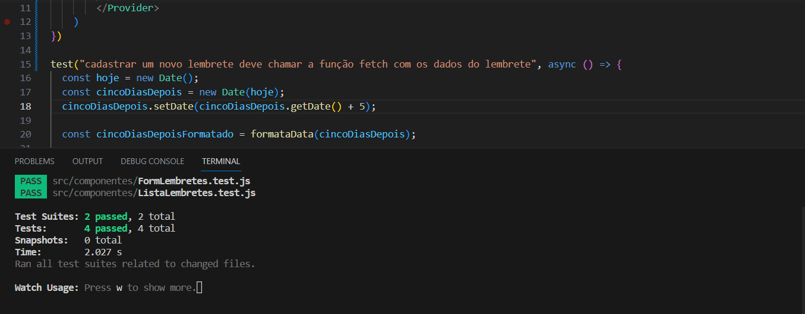
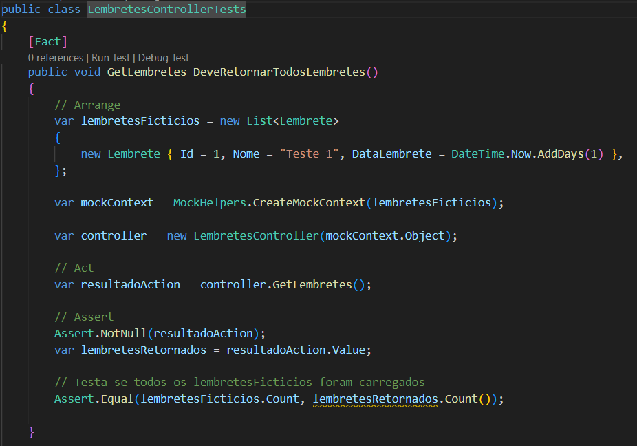
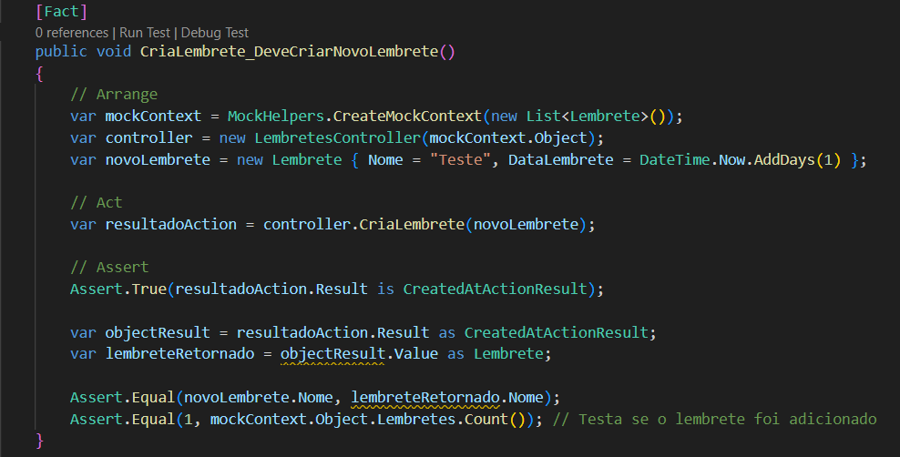
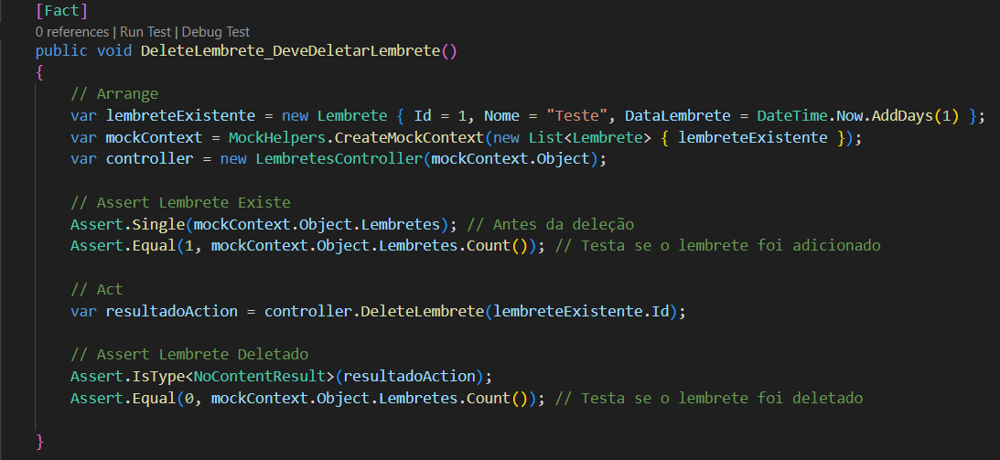

# gestao-lembretes
Uma aplicação web para gerenciar lembretes. Desenvolvida com C#/.net, React e MySQL.


Vídeo demostrativo do Site: 


## Premissas Assumidas
Durante o desenvolvimento deste projeto de lembretes, algumas premissas foram assumidas para facilitar a implementação e atender aos requisitos:

- A aplicação será desenvolvida em C#, React e MySQL
- Os lembretes serão armazenados em um banco de dados MySQL.
- Para fins de teste e demonstração, o sistema utiliza um banco de dados em memória.
- Será utilizado o Redux para gerenciar o estado da aplicação no front-end.
- Os lembretes terão um título/nome e uma data de vencimento.
- Não será implementada a autenticação de usuários neste projeto, permitindo que qualquer pessoa acesse e crie lembretes.
- Os testes foram escritos usando Jest para o Front-end e xUnit e Moq para o Back-end.

## Decisões de Projeto
Algumas decisões de projeto foram tomadas para garantir a eficiência e a funcionalidade do sistema:

- Utilização do Redux: Optei por utilizar o Redux para gerenciar o estado da aplicação, permitindo o compartilhamento de informações entre componentes e facilitando o controle dos lembretes.
- Armazenamento no Banco de Dados: Em vez de usar o banco de dados da memória para armazenar os lembretes, decidi utilizar um banco de dados MySQL para permitir o armazenamento persistente dos dados e possibilitar o acesso a partir de diferentes dispositivos.
- Banco de Dados em Memória Para Testes: Para fins de teste, demonstração e simplicidade, decidi utilizar um banco de dados em memória para a realização dos testes do Backend.
- Organização do Código: O código foi estruturado 3 pastas principais (frontend, backend e testes-backend) por questão de simplicidade, organização e maior facilidade de compreensão.

## Instruções para Executar o Sistema
Para executar o sistema localmente, siga as etapas abaixo:

Certifique-se de ter o .Net e o MySQL instalados em sua máquina.

Clone este repositório em um diretório de sua escolha:

```bash
git clone https://github.com/urbanobruno/gestao-lembretes.git
```

Acesse o diretório do projeto e instale as dependências do front-end e do back-end:

```bash
cd gestao-lembretes
cd lembretes-app
npm install
```

```bash
cd LembretesAPI
dotnet restore
```

Crie um banco de dados MySQL chamado "gestao_lembretes_db" e execute o seguinte código para criar a tabela de lembretes.

```sql
CREATE DATABASE gestao_lembretes_db;

USE gestao_lembretes_db;

CREATE TABLE Lembretes (
  id INT AUTO_INCREMENT PRIMARY KEY,
  nome VARCHAR(255) NOT NULL,
  dataLembrete DATE NOT NULL
);
```

Configure as credenciais de acesso ao banco de dados no arquivo "LembretesAPI/Program.cs" e troque as informações da conexão MySQL e da sua versão no seguinte trecho de código:

```c#
builder.Services.AddDbContext<LembreteContext>(options => options.UseMySql(
    "Server=localhost;Database=gestao_lembretes_db;User ID=SEUUSUARIO;Password=SUASENHA;Port=3306;", // Coloque as suas informações
    new MySqlServerVersion(new Version(8, 0, 33)) // Troque pela sua versão do seu MySQL
));
```

É possível descobrir a versão do seu MySQL executando o seguinte comando:

```sql
SHOW VARIABLES LIKE "%version%";
```

Inicie o servidor do back-end:

Em um novo terminal, em /LembretesAPI:

```bash
cd gestao-lembretes
cd LembretesAPI
dotnet run
```

Em um novo terminal, em /gestao-lembretes/lembretes-app abra o site do react:

```bash
cd gestao-lembretes
cd lembretes-app
npm start
```

O sistema estará disponível em seu navegador em "http://localhost:3000".
Agora você pode acessar e utilizar o sistema de lembretes.

## Testes Realizados

No meu projeto, implementei alguns testes para garantir a funcionalidade correta tanto no front-end quanto no back-end:

### Testes Front-end:

1 - 2 Testes para garantir se os componentes estão sendo renderizados corretamente:
O teste confirma se os diversos componentes estão renderizando de maneira correta.

2 - 1 Teste para verificar se o cadastro de um novo lembrete aciona a função fetch com os valores adequados:
O teste simula a interação do usuário ao preencher os campos de nome e data do lembrete, e em seguida, clicar no botão de criação. Através do uso do jest.fn(), simulei a resposta da API e verifiquei se a função fetch foi chamada com a URL correta, o método POST e o corpo da requisição contendo os valores esperados.

3 - 1 Teste para garantir que a lista de lembretes está sendo renderizada corretamente:
Esse teste confirma que a renderização da lista está de acordo com os dados providos pelo props e garante que a interface reflita os lembretes cadastrados de forma correta.

Os testes estão localizados dentro da pasta src/componentes.

#### Como executar os testes

```bash
cd gestao-lembretes
cd lembretes-app
npm install
```

Ainda em /lembretes-react/lembretes-app

```bash
npm test
```



### Testes Back-end:

Foram realizados testes para avaliar as funcionalidades centrais da API de gerenciamento de lembretes:

1 - Teste de obter todos os lembretes do banco
Verifica se o sistema pode recuperar todos os lembretes existentes.



2 - Teste para verificar se o cadastro de um novo lembrete aciona a função fetch com os valores adequados.
Verificar se o sistema pode adicionar corretamente um novo lembrete.



3 - Teste para garantir que a lista de lembretes está sendo renderizada corretamente.
Garantir que o sistema pode deletar corretamente um lembrete existente.



Os testes estão localizados na pasta de testes LembretesTestes.

#### Como executar os testes

```bash
cd gestao-lembretes
cd LembretesTestes
dotnet restore
```

Ainda em /gestao-lembretes/LembretesTestes

```bash
dotnet test
```


